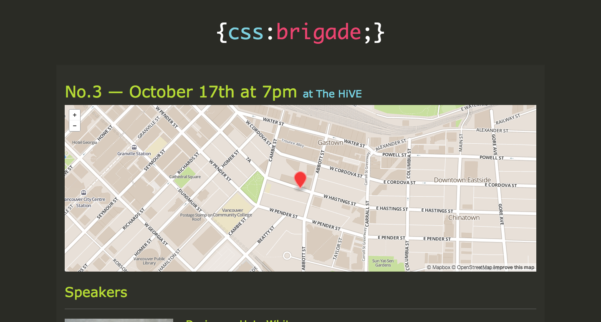

# Tech Meetup Template for Harp.js

A responsive [Harp](http://harpjs.com/) template to publish your tech meetup events.

## Demo

Here’s what this template looks like for [CSS Brigade Vancouver](http://cssbrigade.com/)



## Tech used

The only two requirements to be able to customize this template are __Jade__ and __JSON__. The other languages/libraries make the website work, but you’re not required to change them.

This project comes with previously used data and 3 events preloaded, so you can use that as a template and replace it with your own content.

These are all the pieces used:

- [Jade](http://jade-lang.com/): Cleaner and faster to write HTML (automatically compiled by Harp)
- [Less + Bootstrap](http://getbootstrap.com/css/): CSS pre-processor (automatically compiled by Harp)
- [Harp](http://harpjs.com/docs/quick-start): Static web server with built-in preprocessing
- [Reveal.js](http://lab.hakim.se/reveal-js/#/) HTML presentations made easy (For organizer’s slides)

## Getting started

### Clone this project

    $ git clone git@github.com:jorgepedret/tech-meetup-template.git
    $ cd tech-meetup-template

### Run harp server

Make sure you have [Node.js](http://nodejs.org/) installed, then run:

    npm install -g harp

Once harp is installed, run:

    $ harp server
    # ------------
    # Harp v0.12.1 – Chloi Inc. 2012–2014
    # Your server is listening at http://localhost:9000/
    # Press Ctl+C to stop the server
    # ------------

After you run the Harp server, open your browser at http://localhost:9000/ and you’re ready to start customizing your website.

## Adding a new event

### Create event page

Duplicate the `/public/events/_example_event.jade` file and name it after your event name or the number of the event. Then customize the title, speakers, event description and sponsors (if you have any).

### Add event metadata

Open `/public/events/_data.json`, copy one of the previous events (or remove the placeholder ones) and replace the text with your meetup information. It should look something like this:

```
"1": {   <-- "1" should match the event file name without the extension
  "date": "June 17th at 7pm",
  "location": "Hootsuite Headquarters",
  "map": "http://a.tiles.mapbox.com/v3/jorgepedret.map-2hotlmhu.html#16/49.26385/-123.10439000000004",
  "passed": false
}
```

You now should be able to access the new event by going to `http://localhost:9000/events/1` or if you named your event file `awesome-event.jade`, then you can access it via `http://localhost:9000/events/awesome-event`. Just remember that the event file name and the key in _data.json should match.

### Make it show in the home page

To make the event show up in the home page, open `/public/index.jade` and replace the partial function with the new page event you created. I.e.: `!= partial("events/awesome-event")`.

## Files and Directory structure

In order to keep the instructions simple, I preferred to leave example content that you can use as a guideline to replace with your content. If you have any questions, please [create a new issue](#) and I can clarify.

### Event pages — `/public/events/{n}.jade`

Each of these pages represents an individual event. Create one of this for every new event.

### Events metadata — `/public/events/_data.jade`

File where you specify the date, location name, map url and weather it already happened or not for each event.

### Global metadata — `/harp.json`

This is the file where global variables live in the form of JSON. You can add your own variables to this file or customize the existing ones:

- Website domain
- Page title
- Page description
- Google Analytics ID
- Twitter URL
- Meetup URL
- Speaker Submission Email

### Past events — `/pubic/past-events.jade`

This is a public page that list the previous events hosted by your meetup group. Only the events where `passed` equals `true` in `/public/events/_data.jade` will be listed here.

### Logo placeholder — `/public/_partials/logo.jade`

Put your logo’s markup inside this partial and it should be automatically included in the layout. It should support any format (text, img, svg, etc.).

### Main Layout — `/public/_layout.jade`

The site’s main layout.

### Home Page — `/public/index.jade`

The site’s home page. Only used right now to update the latest event.

### Organizer intro slides — `/public/intro/{n}.jade`

For every event, we create a quick presentation for the organizer to open the event, showing the goals of the meetup, speakers, sponsors, etc.

The slides can be accessed by going to `http://localhost:9000/intro/{n}`.

## FAQ

### How do I customize the map?

I wish this process was simpler, but what I’m doing right now is going to [Mapbox](https://www.mapbox.com/projects/), create a custom map of the location where the event is going to be hosted and then I take the URL that is in the iframe code that they provide.

The map URL is different for each event and it should be entered in `/public/events/_data.json` file. Since we only host our meetup in 2 different places, I can easily reuse previous maps that I generated.

That URL is automatically placed in a responsive iframe so you don’t have to worry about the size.

The meetup that we host 

### How do I customize Bootstrap?

Comment out lines in `/public/css/_bootstrap.less` to include/exclude any of the bootstrap components.

Create, modify or override variables in `/public/css/_variables.less`.

### How do I ask a question/report bug/request feature?

Please, create a ticket.

## TODO

Just create a ticket or a pull request if there’s any new things you want to add or bugs.

- Make template files more self-explainable
- Clean up unnecessary files
- Update the TODO list

## License

MIT